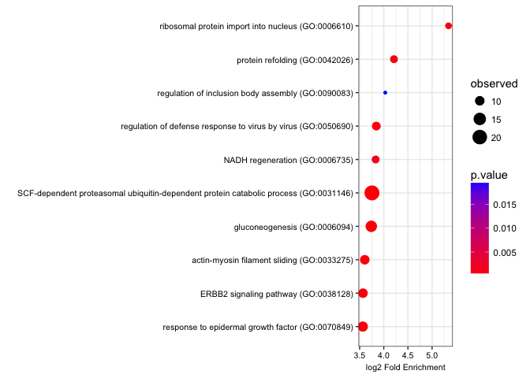
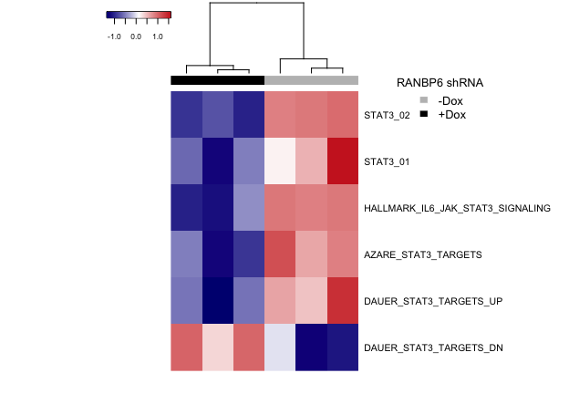
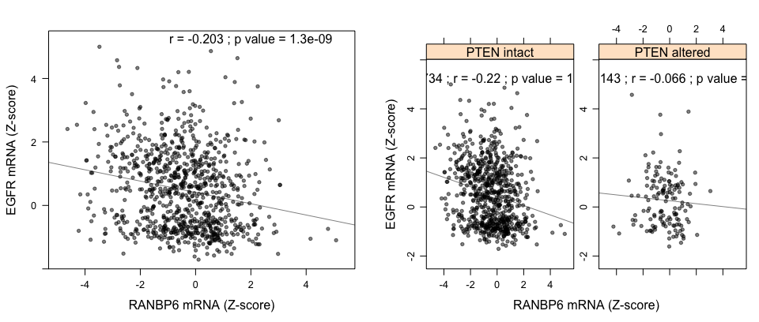
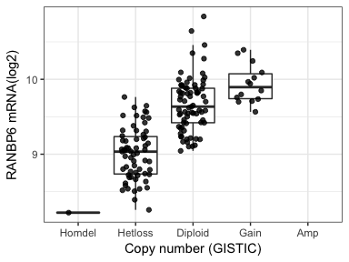
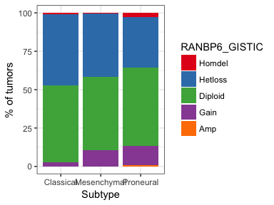
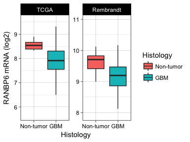
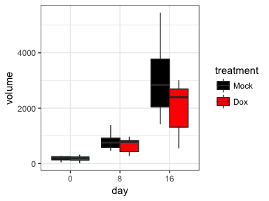
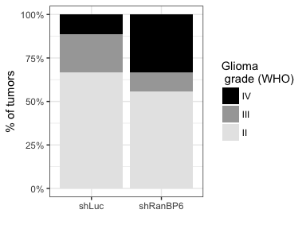

<!-- README.md is generated from README.Rmd. Please edit that file -->
### EGFR feedback-inhibition by Ran-Binding Protein 6 is disrupted in cancer

Barbara Oldrini‡, Wan-Ying Hsieh‡, Hediye Erdjument-Bromage, Paolo Codega, Maria Stella Carro, Alvaro Curiel-García2, Carl Campos, Maryam Pourmaleki, Christian Grommes, Igor Vivanco, Daniel Rohle, Craig M. Bielski, Barry S. Taylor, Travis J. Hollmann, Marc Rosenblum, Paul Tempst, John Blenis, Massimo Squatrito, Ingo K. Mellinghoff. *Nature Communications* (in press)

**Libraries to be installed and loaded**

``` r
library("tidyverse")
library("reshape2")
library("scales")
library("GOSemSim")
library("clusterProfiler")
library("cgdsr")
library("gridExtra")
library("GSEABase")
library("GSVA")
library("heatmap3")
library("lattice")
library("weights")
```

Gene Ontology, Figure 1a right. The gene ontology enrichment was performed using the Gene Ontology Consotrium website (www.geneontology.org), through the analysis tools from the PANTHER Classification System, by uploading the list of the Uniprot\_IDs of the proteins identified in the mass spectrometry experiments. The enrichment results were then filtered to reduce the number of redundant GO classes, by using the “Clusterprofiler” and “GOSemSim”

``` r
# Load GO raw data
TableS2_raw <- read_delim("data/raw/TableS2_raw.txt", "\t", escape_double = FALSE, trim_ws = TRUE, skip = 6)
names(TableS2_raw) <- c("GO biological process complete","ref","observed","expected","(over/under)","Fold Enrichment","p.value")
TableS2_raw$ID <- apply(TableS2_raw[,1],MARGIN = 1, FUN = function (x) {gsub(".*\\((.*)\\).*", "\\1",x)})

# simplify GO
EGFR_go_BP <- new("enrichResult", ontology='BP', result = TableS2_raw) %>% 
  simplify(cutoff = 0.7, by="Fold Enrichment", select_fun=max)
Table_S2 <- EGFR_go_BP@result
Table_S2 %>% 
  .[-which(duplicated(.[,2:6])), ] %>% # filter outduplicated categories  
  .[1:10, ] %>% # select only the first 10 categories
  ggplot(aes(x = reorder(`GO biological process complete`, `Fold Enrichment`), 
             y = log2(`Fold Enrichment`), size = `observed`, color=`p.value`)) + 
  geom_point() + scale_color_gradient(low="red", high="blue") + labs(y = "log2 Fold Enrichment", x ="") +
  coord_flip() + theme_bw() +
  theme(axis.text.x = element_text(colour = "black", size = 8, vjust =1 ),
        axis.text.y = element_text(colour = "black", size = 8, hjust =1 ),
        axis.title = element_text(margin = margin(10, 5, 0, 0), color = "black", size = 8),
        axis.title.y = element_text(angle = 90)
  )
```



Microarray analysis, Figure 3d

``` r
# Load expression data analysis (see below)
exprs.data <- read.delim("data/processed/293T_BP6_expression_data.txt", stringsAsFactors = F)

## Alternatively, analize the Affymetrix CEL files
# require("affy")
# require("annaffy")
# require("hgu133plus2.db")
# files <- list.files("data/raw/")
# files.1 <- grep(".CEL", files, value=TRUE)
# cel <- ReadAffy(filenames=files.1)
# normExprs <- expresso(cel, bgcorrect.method = 'rma',
# normalize.method = 'quantiles',
# pmcorrect.method = 'pmonly',
# summary.method = 'medianpolish')
# exprs.data <- exprs(normExprs)
# probes.to.symbols <- function(probes, chip) {
#   symbols <- sapply(aafSymbol(probes, chip), function (x) { ifelse (length (x!=0), x, NA) } )
#   names(symbols) <- probes
#   return(symbols)
# }
# gene.names <- probes.to.symbols(rownames (exprs.data), "hgu133plus2.db")
# aggregate.data <- aggregate(exprs.data, by=list (gene.names), FUN = median)
# rownames (aggregate.data) <- aggregate.data[[1]]
# aggregate.data <- aggregate.data[,-1]
# exprs.data <- round(aggregate.data, digits = 4)
# rm(aggregate.data,cel,files,files.1,gene.names,normExprs)
# names(exprs.data) <- sub(".CEL","", names(exprs.data))
# names(exprs.data) <- sub("^293T-","", names(exprs.data))

#Perform ssGSEA analysis on STAT3 gene lists
stat3_gene_list <- getBroadSets(asBroadUri(c("DAUER_STAT3_TARGETS_DN","DAUER_STAT3_TARGETS_UP",
                                             "AZARE_STAT3_TARGETS","HALLMARK_IL6_JAK_STAT3_SIGNALING",
                                             "STAT3_01","STAT3_02"), 
                                           base='http://software.broadinstitute.org/gsea/msigdb/cards'))
stat3_gene_list <- geneIds(stat3_gene_list)
gsva_results <- gsva(expr = as.matrix(exprs.data), gset.idx.list = stat3_gene_list, verbose= FALSE,
                     method="ssgsea", rnaseq=FALSE, min.sz=15, max.sz=10000, parallel.sz = 20)
col <- c("gray","gray","gray","black","black","black")
pv.list <- apply(gsva_results,1,function(x){t.test(x[1:3],x[4:6])$p.value})

# Plot heatmap
heatmap3(gsva_results, Rowv = NA, margins = c(2,10), cexRow = 1, cexCol = 0.8, ColSideColors = col, ColSideLabs ="",labCol=NA)
legend(0.7, 1, legend = c("-Dox","+Dox"), fill = c("gray","black"), 
       border = FALSE, bty = "n", y.intersp = 1, cex = 0.8, title = "RANBP6 shRNA")
```



``` r
# Summary statistic
pv.list
#>           DAUER_STAT3_TARGETS_DN           DAUER_STAT3_TARGETS_UP 
#>                     0.0354100967                     0.0134293687 
#>              AZARE_STAT3_TARGETS HALLMARK_IL6_JAK_STAT3_SIGNALING 
#>                     0.0031665408                     0.0166184257 
#>                         STAT3_01                         STAT3_02 
#>                     0.0479655017                     0.0005598989
```

CCLE EGFR-RANBP6 mRNA correlation

``` r
# Download CCLE data from the cBio Portal
mycgds = CGDS("http://www.cbioportal.org/public-portal/")
df.EGFR.ccle <- getProfileData(mycgds, "EGFR", "cellline_ccle_broad_mrna_median_Zscores",
                               "cellline_ccle_broad_3way_complete")
colnames(df.EGFR.ccle) <- "EGFR_mRNA_Zscores"
df.RANBP6.ccle <- getProfileData(mycgds, "RANBP6", "cellline_ccle_broad_mrna_median_Zscores",
                                 "cellline_ccle_broad_3way_complete")
colnames(df.RANBP6.ccle) <- "RANBP6_mRNA_Zscores"
df.PTEN.ccle <- getProfileData(mycgds, "PTEN", c("cellline_ccle_broad_CNA", "cellline_ccle_broad_mutations"),
                               "cellline_ccle_broad_3way_complete")
colnames(df.PTEN.ccle) <- c("PTEN_gistic", "PTEN_mut")
df.PTEN.ccle$PTEN_gistic <- as.numeric(as.character(df.PTEN.ccle$PTEN_gistic))# there is an issue with the gistic data when downloaded with mut data
df.ccle <- cbind(df.EGFR.ccle, df.RANBP6.ccle, df.PTEN.ccle)
rm(df.EGFR.ccle, df.RANBP6.ccle,df.PTEN.ccle)
df.ccle$PTEN_status <- ifelse(!is.na(df.ccle$PTEN_mut), "PTEN altered", "PTEN intact")
df.ccle$PTEN_status <- ifelse(df.ccle$PTEN_gistic == -2,"PTEN altered", df.ccle$PTEN_status)
df.ccle$PTEN_status <- factor(df.ccle$PTEN_status, levels = c("PTEN intact","PTEN altered"))

# CCLE EGFR-RANBP6 mRNA correlation
p1 <- xyplot(EGFR_mRNA_Zscores ~ RANBP6_mRNA_Zscores, data = df.ccle, pch = 20, ylim = c(-2, 5.5),
             xlab = "RANBP6 mRNA (Z-score)", ylab = "EGFR mRNA (Z-score)", type = c("p", "r"), alpha = 0.5, col = "black",
             scales = list(tck = c(1, 0)),
             panel = function (x,y,...){
               panel.xyplot(x,y,...)
               cor <- cor.test(x,y)
               panel.text (2, 5.25, cex = 1, paste("r =",round(cor$estimate, digits = 3),";",
                                                   "p value =",signif(cor$p.value, digits = 2)))
             })

# CCLE EGFR-RANBP6 mRNA correlation, separated by PTEN status 
p2 <- xyplot(EGFR_mRNA_Zscores~RANBP6_mRNA_Zscores | PTEN_status, data = df.ccle, pch = 20,
             scales = list( y = list(relation = "free")),  
             ylim = c(-2, 5.5), xlab = "RANBP6 mRNA (Z-score)", ylab = "EGFR mRNA (Z-score)", 
             type = c("p", "r"), alpha = 0.5, col = "black",
             panel = function(x,y,...){
               panel.xyplot(x,y,...)
               cor <- cor.test(x,y)
               n <- length(x)
               panel.text (0.5, 5.25, cex = 1, paste("N =",n,";","r =",round(cor$estimate, digits = 3),";",
                                                     "p value =",signif(cor$p.value, digits = 2)))
             })
```

Figure 5e 

GBM expression data Expression data were downloaded at: gliovis.bioinfo.cnio.es

``` r
Table_S8 <- readxl::read_excel("~/oldrini2017/data/processed/Table S8.xlsx", 
    col_types = c("text", "text", "numeric", 
        "numeric", "text", "numeric", "text", 
        "blank", "blank"), skip = 1) %>%
  mutate(Histology = factor(Histology, levels = c("Non-tumor", "GBM")),
         Subtype = factor(Subtype, levels = c("Classical","Mesenchymal","Proneural")),
         RANBP6_GISTIC = factor(RANBP6_GISTIC, levels = c(-2:2), labels = c("Homdel", "Hetloss", "Diploid", "Gain", "Amp")),
         RANBP6_GISTIC = droplevels(RANBP6_GISTIC),
         Dataset = factor(Dataset, levels = c("TCGA", "Rembrandt")))
```

Figure 6b

``` r
Table_S8 %>%
  filter(Dataset == "TCGA" & RANBP6_GISTIC != is.na(RANBP6_GISTIC)) %>%
  ggplot(aes(x = RANBP6_GISTIC, y = `RANBP6_mRNA (RNAseq)`)) +
  geom_boxplot(outlier.size = 0, outlier.stroke = 0) +
  geom_jitter(position = position_jitter(width = .25), alpha = 0.8) + theme_bw() +
  ylab("RANBP6 mRNA(log2)") + xlab("Copy number (GISTIC)")
```



Supplementary Figure 6

``` r
table(Table_S8$Subtype, Table_S8$RANBP6_GISTIC) %>%
  prop.table(., 1) %>% 
  melt(., varnames = c("Subtype", "RANBP6_GISTIC"), id.vars = "Subtype") %>% 
  mutate(value = value*100) %>% 
  ggplot(aes(x = Subtype, y = value, fill = RANBP6_GISTIC)) +
  geom_bar(stat = "identity") + scale_fill_brewer(palette = "Set1") +
  labs(x = "Subtype", y = "% of tumors") + 
  theme_bw()
```



Supplementary Figure 7

``` r
Table_S8 %>%
  ggplot(aes(x = Histology, y = `RANBP6_mRNA (Affimetrix)`)) + ylab("RANBP6 mRNA (log2)") +
  geom_boxplot(aes(fill = Histology),outlier.size = 0, outlier.stroke = 0) +
  facet_wrap(~Dataset, scales = "free_y",ncol = 2) +
  theme_linedraw()
```



``` r
table(Table_S8$Dataset,Table_S8$Histology)
#>            
#>             Non-tumor GBM
#>   TCGA             10 528
#>   Rembrandt        28 219
```

Figure 6f

``` r
readxl::read_excel("data/raw/Figure6f_data.xlsx", col_types = c("text", "numeric", "numeric", "text")) %>%
  mutate(treatment = factor(treatment,levels = c("Mock","Dox")), day = factor(day)) %>% 
  filter(day %in% c(0,8,16)) %>% 
  ggplot(aes(x = day, y = volume, fill = treatment)) + 
  geom_boxplot(outlier.shape = NA) + scale_fill_manual(values = c("black","red")) +
  theme_bw()
```

 Figure 6h

``` r
Figure6g_data <- read_csv("data/raw/Figure6g_data.csv")
table(Figure6g_data$Grade, Figure6g_data$shRNA) %>%
  melt(., varnames = c("Grade", "shRNA"), id.vars = "Grade") %>%
  ggplot(., aes(x = shRNA, y = value, fill = forcats::fct_rev(Grade))) +
  geom_bar(position = "fill", stat = "identity") +
  scale_y_continuous(labels = percent_format()) +
  scale_fill_grey(start = 0, end = .9) +
  labs(x = "", y = "% of tumors") +  
  guides(fill=guide_legend(title="Glioma \n grade (WHO)")) +
  theme_bw()
```



Session info

    #> Session info -------------------------------------------------------------
    #>  setting  value                       
    #>  version  R version 3.4.1 (2017-06-30)
    #>  system   x86_64, darwin15.6.0        
    #>  ui       X11                         
    #>  language (EN)                        
    #>  collate  en_US.UTF-8                 
    #>  tz       Europe/Madrid               
    #>  date     2017-11-28
    #> Packages -----------------------------------------------------------------
    #>  package         * version    date       source                         
    #>  acepack           1.4.1      2016-10-29 CRAN (R 3.4.0)                 
    #>  annotate        * 1.54.0     2017-04-25 Bioconductor                   
    #>  AnnotationDbi   * 1.38.2     2017-07-27 Bioconductor                   
    #>  assertthat        0.2.0      2017-04-11 CRAN (R 3.4.0)                 
    #>  backports         1.1.1      2017-09-25 CRAN (R 3.4.2)                 
    #>  base            * 3.4.1      2017-07-07 local                          
    #>  base64enc         0.1-3      2015-07-28 CRAN (R 3.4.0)                 
    #>  bindr             0.1        2016-11-13 CRAN (R 3.4.0)                 
    #>  bindrcpp        * 0.2        2017-06-17 CRAN (R 3.4.0)                 
    #>  Biobase         * 2.36.2     2017-05-04 Bioconductor                   
    #>  BiocGenerics    * 0.22.1     2017-10-07 Bioconductor                   
    #>  BiocParallel      1.10.1     2017-05-03 Bioconductor                   
    #>  bit               1.1-12     2014-04-09 CRAN (R 3.4.0)                 
    #>  bit64             0.9-7      2017-05-08 CRAN (R 3.4.0)                 
    #>  bitops            1.0-6      2013-08-17 CRAN (R 3.4.0)                 
    #>  blob              1.1.0      2017-06-17 CRAN (R 3.4.0)                 
    #>  broom             0.4.2      2017-02-13 CRAN (R 3.4.0)                 
    #>  cellranger        1.1.0      2016-07-27 CRAN (R 3.4.0)                 
    #>  cgdsr           * 1.2.6      2017-04-11 CRAN (R 3.4.0)                 
    #>  checkmate         1.8.5      2017-10-24 CRAN (R 3.4.2)                 
    #>  cluster           2.0.6      2017-03-10 CRAN (R 3.4.1)                 
    #>  clusterProfiler * 3.4.4      2017-06-20 Bioconductor                   
    #>  colorspace        1.3-2      2016-12-14 CRAN (R 3.4.0)                 
    #>  compiler          3.4.1      2017-07-07 local                          
    #>  data.table        1.10.4-2   2017-10-12 CRAN (R 3.4.2)                 
    #>  datasets        * 3.4.1      2017-07-07 local                          
    #>  DBI               0.7        2017-06-18 CRAN (R 3.4.0)                 
    #>  devtools          1.13.3     2017-08-02 CRAN (R 3.4.1)                 
    #>  digest            0.6.12     2017-01-27 CRAN (R 3.4.0)                 
    #>  DO.db             2.9        2017-05-05 Bioconductor                   
    #>  DOSE            * 3.2.0      2017-04-25 Bioconductor                   
    #>  dplyr           * 0.7.4      2017-09-28 CRAN (R 3.4.2)                 
    #>  evaluate          0.10.1     2017-06-24 CRAN (R 3.4.1)                 
    #>  fastcluster       1.1.24     2017-08-21 CRAN (R 3.4.1)                 
    #>  fastmatch         1.1-0      2017-01-28 CRAN (R 3.4.0)                 
    #>  fgsea             1.2.1      2017-04-25 Bioconductor                   
    #>  forcats           0.2.0      2017-01-23 CRAN (R 3.4.0)                 
    #>  foreign           0.8-69     2017-06-22 CRAN (R 3.4.1)                 
    #>  Formula         * 1.2-2      2017-07-10 CRAN (R 3.4.1)                 
    #>  gdata           * 2.18.0     2017-06-06 CRAN (R 3.4.0)                 
    #>  ggplot2         * 2.2.1.9000 2017-05-05 Github (hadley/ggplot2@f4398b6)
    #>  glue              1.1.1      2017-06-21 CRAN (R 3.4.1)                 
    #>  GO.db             3.4.1      2017-05-05 Bioconductor                   
    #>  GOSemSim        * 2.2.0      2017-04-25 Bioconductor                   
    #>  graph           * 1.54.0     2017-04-25 Bioconductor                   
    #>  graphics        * 3.4.1      2017-07-07 local                          
    #>  grDevices       * 3.4.1      2017-07-07 local                          
    #>  grid              3.4.1      2017-07-07 local                          
    #>  gridExtra       * 2.3        2017-09-09 CRAN (R 3.4.1)                 
    #>  GSEABase        * 1.38.2     2017-09-21 Bioconductor                   
    #>  GSVA            * 1.24.2     2017-09-02 Bioconductor                   
    #>  gtable            0.2.0      2016-02-26 CRAN (R 3.4.0)                 
    #>  gtools            3.5.0      2015-05-29 CRAN (R 3.4.0)                 
    #>  haven             1.1.0      2017-07-09 CRAN (R 3.4.1)                 
    #>  heatmap3        * 1.1.1      2015-04-12 CRAN (R 3.4.0)                 
    #>  Hmisc           * 4.0-3      2017-05-02 CRAN (R 3.4.0)                 
    #>  hms               0.3        2016-11-22 CRAN (R 3.4.0)                 
    #>  htmlTable         1.9        2017-01-26 CRAN (R 3.4.0)                 
    #>  htmltools         0.3.6      2017-04-28 CRAN (R 3.4.0)                 
    #>  htmlwidgets       0.9        2017-07-10 CRAN (R 3.4.1)                 
    #>  httr              1.3.1      2017-08-20 CRAN (R 3.4.1)                 
    #>  igraph            1.1.2      2017-07-21 CRAN (R 3.4.1)                 
    #>  IRanges         * 2.10.5     2017-10-08 Bioconductor                   
    #>  jsonlite          1.5        2017-06-01 CRAN (R 3.4.0)                 
    #>  knitr             1.17       2017-08-10 CRAN (R 3.4.1)                 
    #>  labeling          0.3        2014-08-23 CRAN (R 3.4.0)                 
    #>  lattice         * 0.20-35    2017-03-25 CRAN (R 3.4.1)                 
    #>  latticeExtra      0.6-28     2016-02-09 CRAN (R 3.4.0)                 
    #>  lazyeval          0.2.0      2016-06-12 CRAN (R 3.4.0)                 
    #>  lubridate         1.6.0      2016-09-13 CRAN (R 3.4.0)                 
    #>  magrittr          1.5        2014-11-22 CRAN (R 3.4.0)                 
    #>  MASS              7.3-47     2017-02-26 CRAN (R 3.4.1)                 
    #>  Matrix            1.2-11     2017-08-16 CRAN (R 3.4.1)                 
    #>  memoise           1.1.0      2017-04-21 CRAN (R 3.4.0)                 
    #>  methods         * 3.4.1      2017-07-07 local                          
    #>  mice            * 2.46.0     2017-10-24 CRAN (R 3.4.2)                 
    #>  mnormt            1.5-5      2016-10-15 CRAN (R 3.4.0)                 
    #>  modelr            0.1.1      2017-07-24 CRAN (R 3.4.1)                 
    #>  munsell           0.4.3      2016-02-13 CRAN (R 3.4.0)                 
    #>  nlme              3.1-131    2017-02-06 CRAN (R 3.4.1)                 
    #>  nnet              7.3-12     2016-02-02 CRAN (R 3.4.1)                 
    #>  parallel        * 3.4.1      2017-07-07 local                          
    #>  pkgconfig         2.0.1      2017-03-21 CRAN (R 3.4.0)                 
    #>  plyr              1.8.4      2016-06-08 CRAN (R 3.4.0)                 
    #>  psych             1.7.8      2017-09-09 CRAN (R 3.4.1)                 
    #>  purrr           * 0.2.4      2017-10-18 CRAN (R 3.4.2)                 
    #>  qvalue            2.8.0      2017-04-25 Bioconductor                   
    #>  R.methodsS3       1.7.1      2016-02-16 CRAN (R 3.4.0)                 
    #>  R.oo              1.21.0     2016-11-01 CRAN (R 3.4.0)                 
    #>  R6                2.2.2      2017-06-17 CRAN (R 3.4.0)                 
    #>  RColorBrewer      1.1-2      2014-12-07 CRAN (R 3.4.0)                 
    #>  Rcpp              0.12.13    2017-09-28 CRAN (R 3.4.2)                 
    #>  RCurl             1.95-4.8   2016-03-01 CRAN (R 3.4.0)                 
    #>  readr           * 1.1.1      2017-05-16 CRAN (R 3.4.0)                 
    #>  readxl            1.0.0      2017-04-18 CRAN (R 3.4.0)                 
    #>  reshape2        * 1.4.2      2016-10-22 CRAN (R 3.4.0)                 
    #>  rlang             0.1.2      2017-08-09 CRAN (R 3.4.1)                 
    #>  rmarkdown         1.6        2017-06-15 CRAN (R 3.4.0)                 
    #>  rpart             4.1-11     2017-03-13 CRAN (R 3.4.1)                 
    #>  rprojroot         1.2        2017-01-16 CRAN (R 3.4.0)                 
    #>  RSQLite           2.0        2017-06-19 CRAN (R 3.4.1)                 
    #>  rvcheck           0.0.9      2017-07-10 CRAN (R 3.4.1)                 
    #>  rvest             0.3.2      2016-06-17 CRAN (R 3.4.0)                 
    #>  S4Vectors       * 0.14.7     2017-10-08 Bioconductor                   
    #>  scales          * 0.5.0      2017-08-24 CRAN (R 3.4.1)                 
    #>  splines           3.4.1      2017-07-07 local                          
    #>  stats           * 3.4.1      2017-07-07 local                          
    #>  stats4          * 3.4.1      2017-07-07 local                          
    #>  stringi           1.1.5      2017-04-07 CRAN (R 3.4.0)                 
    #>  stringr           1.2.0      2017-02-18 CRAN (R 3.4.0)                 
    #>  survival        * 2.41-3     2017-04-04 CRAN (R 3.4.1)                 
    #>  tibble          * 1.3.4      2017-08-22 CRAN (R 3.4.1)                 
    #>  tidyr           * 0.7.2      2017-10-16 CRAN (R 3.4.2)                 
    #>  tidyselect        0.2.2      2017-10-10 CRAN (R 3.4.2)                 
    #>  tidyverse       * 1.1.1      2017-01-27 CRAN (R 3.4.0)                 
    #>  tools             3.4.1      2017-07-07 local                          
    #>  utils           * 3.4.1      2017-07-07 local                          
    #>  weights         * 0.85       2016-02-12 CRAN (R 3.4.0)                 
    #>  withr             2.0.0      2017-07-28 CRAN (R 3.4.1)                 
    #>  XML             * 3.98-1.9   2017-06-19 CRAN (R 3.4.1)                 
    #>  xml2              1.1.1      2017-01-24 CRAN (R 3.4.0)                 
    #>  xtable            1.8-2      2016-02-05 CRAN (R 3.4.0)                 
    #>  yaml              2.1.14     2016-11-12 CRAN (R 3.4.0)
